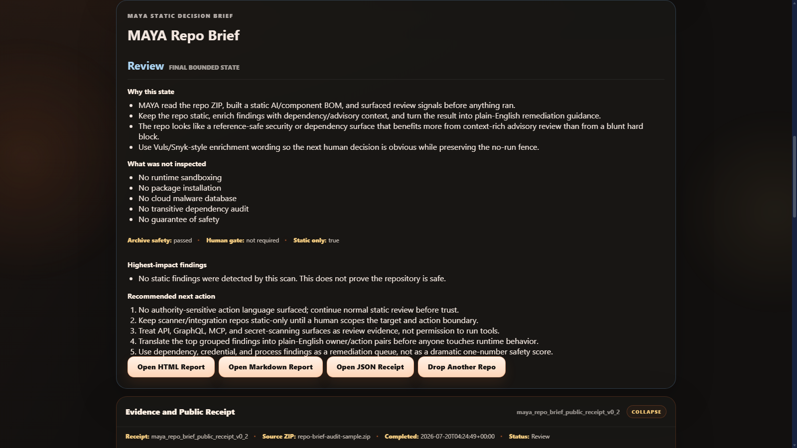

# MAYA Repo Brief

**See what MAYA sees before repo code runs.**

MAYA Repo Brief is a local repository ZIP scanner for bounded static analysis. It inspects archive structure and selected source signals, then produces public-safe Markdown, HTML, and JSON receipts without executing repository code or installing dependencies.

> Repo Brief cannot prove that a repository is safe. It identifies static signals that help a human decide what deserves deeper review.



## What it checks

- ZIP traversal, path collision, symlink, device-name, compression-ratio, and extraction-budget hazards
- Install hooks and dependency manifests
- Credential-shaped values with redaction
- Process, filesystem, persistence, binary, and network string surfaces
- Self-declared provenance and reuse signals
- AI/component inventory and agent/MCP workflow surfaces

Public conclusions are deliberately bounded to:

- `No signal detected by this scan`
- `Review`
- `Risk`
- `Blocked`

## Quick start

Requirements: Python 3.11, 3.12, or 3.13.

Windows:

```text
OPEN - MAYA Repo Brief.cmd
```

Any supported platform:

```bash
python maya_lens_server.py
```

Open `http://127.0.0.1:5182/` and choose a repository ZIP you are authorized to inspect.

No dependency installation is required.

## Command-line scan

```bash
python maya_lens_server.py --scan path/to/repository.zip
```

## Verification

Every referenced test ships in this repository:

```bash
python -m py_compile src/maya_lens/*.py maya_lens_server.py
python tests/test_maya_lens_scanner.py
python tests/test_maya_lens_server.py
python tests/test_public_release_contract.py
node --check web/app.js
```

A ready-to-enable GitHub Actions template is included at `docs/ci/verify.yml.example`; local verification remains the release authority for this beta.

## Privacy and retention

- Uploaded ZIPs remain local and are removed after each scan attempt.
- Raw scan state is memory-only by default.
- Only public-projected reports and history metadata are retained locally.
- Retained history and reports can be deleted through the UI.
- The tool makes no repository network calls and sends no telemetry.

## Security boundary

The server binds to loopback and uses Host, Origin, and in-memory session-token checks for mutating requests. It emits CSP, anti-frame, no-sniff, referrer, permissions, COOP, and CORP browser hardening headers.

Do not expose the local server directly to the internet. See [SAFETY_BOUNDARY.md](SAFETY_BOUNDARY.md) and [SECURITY.md](SECURITY.md).

## License

Source-available under the [2ndNatureAi Public Beta Evaluation License](LICENSE.txt). Evaluation and good-faith security research are allowed; redistribution, commercial use, hosted service use, and production deployment require written authorization.

Copyright © 2026 2ndNatureAi.
